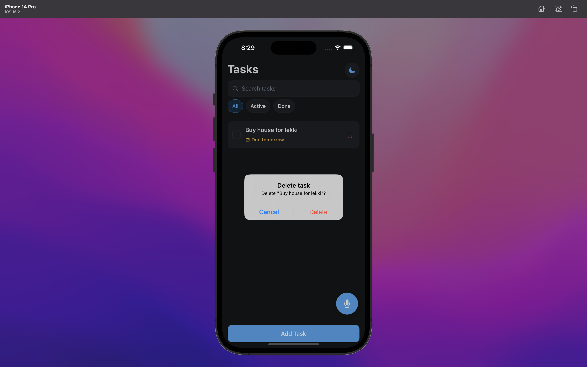
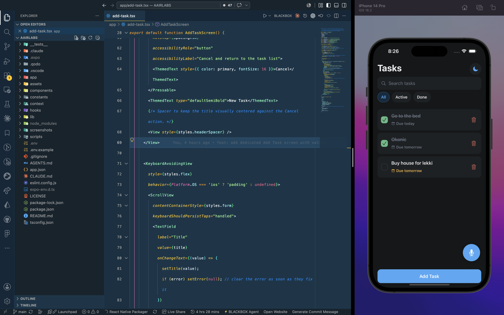

# AAIRLABS — To-Do List App

A simple, clean **React Native** (Expo SDK 54, expo-router) to-do list. Add,
complete, and delete tasks; browse them on one screen; keep them across launches;
and dictate new tasks by voice through a floating action button.

## Features

- **Task list** — a single scrollable list with a clear completed / incomplete
  distinction (checked, muted, strikethrough) and an intentional empty state.
- **Add / complete / delete** — a dedicated, validated Add Task screen (empty
  titles are blocked); tap to toggle; delete with confirmation.
- **Local persistence** — every change is saved to `AsyncStorage`; the list is
  restored on relaunch. No backend, no account.
- **Voice input** — a mic FAB records a phrase, transcribes it (Groq Whisper), and
  splits natural dictation ("buy provisions and call mom") into separate tasks.
- **Bonus (Phase 4):**
  - **Due dates + sorting** — pick a due date on Add Task; the list sorts dated
    tasks first (soonest due at top) and shows an amber "due soon" / red "overdue" badge.
  - **Search & filter** — search by title/description and filter All / Active / Done.
  - **Light / dark / system theme toggle** — a header control that persists your choice.
  - **Unit tests** — Jest coverage for the task splitter, due-date helpers, and storage.
  - **Animations** — task enter/reorder transitions and an animated completion
    check, all disabled when the OS reduced-motion setting is on.

## Screenshots

Captured on an iOS Simulator (iPhone 14 Pro, light) and an Android emulator
(Pixel, dark), shown side by side. Full images live in [`/screenshots`](./screenshots).

### Task list — empty state & populated list

Empty state ("No tasks yet") on Android; a populated list on iOS with due-date
badges, All / Active / Done filter chips, a search box, a completed task
(checked, muted, strikethrough), and the voice FAB.


### Add Task screen

Title (required), optional multiline description, and due-date chips.


### Inline validation

Saving with an empty title is blocked with an inline "Please enter a task title." message.


### Voice input — listening

Tapping the mic FAB opens the Listening overlay, which records a phrase, transcribes
it, and splits it into separate tasks.


### Delete task — confirmation

Deleting a task asks for confirmation first, so nothing is removed by accident.



### Code & design

The app source in the editor next to the running iOS build (dark mode) — Tasks
list with search, All / Active / Done filters, due-date badges, and the voice FAB.



## Get started

1. Install dependencies

   ```bash
   npm install
   ```

2. Start the app

   ```bash
   npx expo start
   ```

In the output, you'll find options to open the app in a

- [development build](https://docs.expo.dev/develop/development-builds/introduction/)
- [Android emulator](https://docs.expo.dev/workflow/android-studio-emulator/)
- [iOS simulator](https://docs.expo.dev/workflow/ios-simulator/)
- [Expo Go](https://expo.dev/go), a limited sandbox for trying out app development with Expo

> **SDK note:** this project is pinned to **Expo SDK 54** (see `AGENTS.md`). Do not
> bump the SDK without changing the toolchain.

You can start developing by editing the files inside the **app** directory. This project uses [file-based routing](https://docs.expo.dev/router/introduction).

## Tests

Unit tests cover the highest-value pure logic — the voice task splitter, the
due-date helpers, and the storage round-trip / corrupt-data fallback:

```bash
npm test
```

## Voice input setup (API key)

The voice FAB records a short clip, sends it to Groq's speech-to-text API
(OpenAI-compatible Whisper, free tier), and splits the transcript into tasks. It
needs an API key, read from an Expo public environment variable — the key is
**never** committed.

1. Copy the example env file and add your key:

   ```bash
   cp .env.example .env
   ```

2. Get a free API key at [console.groq.com](https://console.groq.com) (no credit
   card required), then edit `.env` and set it:

   ```bash
   EXPO_PUBLIC_GROQ_API_KEY=gsk_...your-key...
   ```

3. Restart the dev server so Expo picks up the new value (`npx expo start -c`).

Notes:

- `.env` is gitignored; only `.env.example` (no real key) is committed.
- Without a key, the FAB shows a friendly "not configured" message and adds nothing.
- Microphone permission is requested on first use; denial is handled gracefully.
- On the web preview, microphone capture may be blocked by the browser — the app
  degrades gracefully rather than crashing.

## Get a fresh project

When you're ready, run:

```bash
npm run reset-project
```

This command will move the starter code to the **app-example** directory and create a blank **app** directory where you can start developing.

### Other setup steps

- To set up ESLint for linting, run `npx expo lint`, or follow our guide on ["Using ESLint and Prettier"](https://docs.expo.dev/guides/using-eslint/)
- Unit tests use the [`jest-expo`](https://docs.expo.dev/develop/unit-testing/) preset; run them with `npm test`.
- Learn more about the TypeScript setup in this template in our guide on ["Using TypeScript"](https://docs.expo.dev/guides/typescript/)

## Learn more

To learn more about developing your project with Expo, look at the following resources:

- [Expo documentation](https://docs.expo.dev/): Learn fundamentals, or go into advanced topics with our [guides](https://docs.expo.dev/guides).
- [Learn Expo tutorial](https://docs.expo.dev/tutorial/introduction/): Follow a step-by-step tutorial where you'll create a project that runs on Android, iOS, and the web.

## Join the community

Join our community of developers creating universal apps.

- [Expo on GitHub](https://github.com/expo/expo): View our open source platform and contribute.
- [Discord community](https://chat.expo.dev): Chat with Expo users and ask questions.
