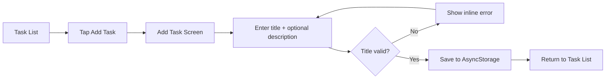
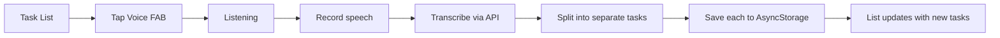
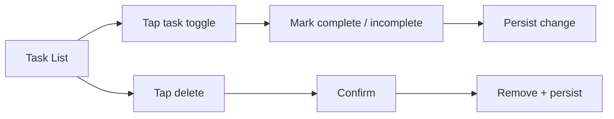

# AAIRLABS To-Do List App — Project Overview

> A simple, clean React Native to-do list — add, complete, and delete tasks; browse them on a dedicated list screen; persist everything locally; and dictate new tasks by voice through a floating action button.

---

## Table of Contents

- [System Context](#system-context)
- [Goal](#goal)
- [Problem Statement](#problem-statement)
- [Target Users](#target-users)
- [Product Areas](#product-areas)
- [Design Direction](#design-direction)
- [Color System](#color-system)
- [Core Screens](#core-screens)
- [Data Persistence](#data-persistence)
- [Voice Input](#voice-input)
- [Shared Components](#shared-components)
- [User Flows](#user-flows)
- [Tech Stack](#tech-stack)
- [Suggested Folder Structure](#suggested-folder-structure)
- [Bonus Scope](#bonus-scope)
- [Out of Scope](#out-of-scope)
- [Submission Requirements](#submission-requirements)
- [Evaluation Criteria](#evaluation-criteria)
- [Short Product Pitch](#short-product-pitch)

---

## System Context

This repo (`AAIRLABS`) is a single-surface React Native mobile app built with **Expo SDK 57** and **expo-router**. It is the AAIRLABS developer exercise: a self-contained to-do list app that runs on iOS, Android, and web from one codebase.

| Concern | Owner |
| ------- | ----- |
| App shell, navigation, screens | This repo — `src/app` (expo-router file-based routing) |
| Task state and persistence | Local device only — AsyncStorage, no backend |
| Voice transcription | External speech-to-text API (OpenAI) called directly from the client |

There is no server, no auth, and no remote database. Every task lives on the device. The only network call is the optional voice-to-text transcription request.

> **Expo has changed.** Before writing or reviewing any app code, read the versioned docs at <https://docs.expo.dev/versions/v57.0.0/>. Do not assume APIs from older SDKs (e.g. `expo-av`, classic `@react-navigation` setup) still apply.

---

## Goal

Build a simple, clean to-do list app in React Native that lets a user add, complete, and delete tasks, view them in one place, and keep them across app launches — with an optional voice mode that turns spoken input into one or more tasks.

---

## Problem Statement

| Problem | App Response |
| ------- | ------------ |
| Task lists get cluttered and hard to scan | Clean layout, clear visual distinction between completed and incomplete tasks |
| Typing tasks on mobile is slow | A floating action button that captures speech and files it as tasks automatically |
| People speak several tasks at once | Intelligently split natural-language dictation ("buy provisions and call mom") into separate tasks |
| Data lost on app close is frustrating | Persist every task locally with AsyncStorage so the list survives restarts |
| Empty and error states feel broken | Design intentional empty states and validate inputs (no empty task titles) |

**The solution:** a focused, two-screen to-do app that is fast to use by hand or by voice, and never loses your list.

---

## Target Users

| User Type | Need |
| --------- | ---- |
| Everyday task-keeper | Quickly jot down, check off, and clear tasks without ceremony |
| On-the-go user | Add tasks hands-free by speaking, even several at once |
| Returning user | Reopen the app and find the same list exactly where they left it |

---

## Product Areas

### 1. Task Management

- add new tasks (title required, description optional)
- mark tasks completed / incomplete (toggle)
- delete tasks
- persist all changes locally

### 2. Task Display

- a single scrollable list of all tasks
- clear visual distinction between completed and incomplete tasks
- an intentional empty state when there are no tasks

### 3. Voice Input

- a floating action button (FAB) that activates voice mode
- listen → transcribe (OpenAI or another speech-to-text API) → add tasks
- split multi-task dictation into separate tasks

---

## Design Direction

### Overall Feel

- simple, clean, and calm
- fast and tactile — checking off a task should feel satisfying
- content-first: the task list is the hero, chrome stays minimal
- accessible by default (labels, hit targets, contrast, reduced motion)

### Design Language

- generous whitespace, one clear primary action per screen
- rounded task rows with soft separation, no heavy borders
- a single brand accent (AAIRLABS blue) for primary actions and the FAB
- completed tasks visually recede (muted text, strikethrough, checked state)
- the voice FAB is the one bold, always-reachable affordance on the list screen
- light-first, with dark mode supported via the existing theme hooks

---

## Color System

Anchored on the AAIRLABS blue already present in `app.json` (splash `#208AEF`, Android adaptive background `#E6F4FE`). Tokens live in `src/constants/theme.ts` and are consumed through the `use-theme` / `use-color-scheme` hooks.

```ts
// Light theme
const light = {
  primary:        '#208AEF', // brand blue — primary actions, FAB
  primaryPressed: '#1B6FBF',
  primarySoft:    '#E6F4FE', // tinted surfaces, active states

  textMain:   '#0F1720',
  textBody:   '#3C4655',
  textMuted:  '#8A94A3', // completed-task text, placeholders
  textInverse:'#FFFFFF',

  bgPage:  '#FFFFFF',
  bgCard:  '#F7F9FC', // task row surface
  border:  '#E6EAF0',

  success: '#2E7D4F', // completed check
  danger:  '#C43D2D', // delete / destructive
  warning: '#F4B740', // due-soon (bonus)
};
```

Dark-theme equivalents live alongside these in `theme.ts`. Never hardcode hex values in components — read from the theme.

---

## Core Screens

The exercise requires **two screens** connected by navigation. Under expo-router (which is built on React Navigation), each screen is a route file in `src/app`.

### 1. Task List Screen — `src/app/index.tsx`

Required UI:

- screen title / header
- scrollable list of all tasks
- each task row: completion toggle (checkbox), title, optional description, delete action
- completed vs incomplete visual distinction (strikethrough + muted, checked state)
- empty state when there are no tasks ("No tasks yet — add one to get started")
- primary "Add Task" entry point (navigates to Add Task screen)
- **Voice FAB** floating above the list (see [Voice Input](#voice-input))

States to handle: empty list, mixed completed/incomplete, voice-listening overlay, voice-processing.

### 2. Add Task Screen — `src/app/add-task.tsx`

Required UI:

- title input (required)
- description input (optional, multiline)
- save / add action
- cancel / back navigation
- inline validation for empty title (block save, show message)
- optional bonus: due-date picker

On save, the task is appended to storage and the user returns to the Task List screen.

### Navigation

- expo-router file-based routing satisfies the "use React Navigation" requirement (expo-router is built on React Navigation).
- Root layout: `src/app/_layout.tsx` defines the stack/navigator.
- List is the initial route; Add Task is pushed on top and dismissed on save/cancel.

---

## Data Persistence

- All tasks persist locally with **AsyncStorage** (`@react-native-async-storage/async-storage`) — must be added to the project.
- A single storage key holds the serialized task array (e.g. `@aairlabs/tasks`).
- Reads happen once on app start (hydrate into state); writes happen on every mutation (add, toggle, delete).
- Persistence is isolated behind a small module (e.g. `src/lib/storage/tasks-storage.ts`) so screens never touch AsyncStorage directly.
- Task shape:

```ts
type Task = {
  id: string;          // uuid / timestamp-based
  title: string;       // required, non-empty
  description?: string;// optional
  completed: boolean;
  createdAt: number;   // epoch ms
  dueDate?: number;    // bonus
};
```

---

## Voice Input

The FAB on the Task List screen drives a listen → transcribe → parse → add pipeline.

1. **Activate** — user taps the FAB; app enters listening mode (visible listening/recording state).
2. **Capture** — record audio using the Expo SDK 57 audio API (`expo-audio`); request microphone permission first.
3. **Transcribe** — send the recording to a speech-to-text API (OpenAI) and receive text.
4. **Split** — parse natural language into discrete tasks: "buy provisions and call mom" → `["Buy provisions", "Call mom"]`. Handle conjunctions ("and", commas, "then") and trim filler.
5. **Add** — append each parsed task to storage and refresh the list.

Handling rules:

- request and gracefully handle denied microphone permission
- show clear listening / processing / error states
- keep the API key out of source control — read from env / Expo config, never commit it
- if transcription returns empty or fails, surface a friendly error and add nothing
- single-task dictation should still work (splitter returns one task)

---

## Shared Components

- task row (title, description, completion toggle, delete)
- completion checkbox / toggle
- delete control (with confirmation for destructive action)
- empty-state block
- floating action button (voice)
- listening / processing overlay
- primary button, text input, screen header
- themed text / themed view (already present in `src/components`)

---

## User Flows

### Add a Task (typed)



### Add Tasks by Voice



### Complete / Delete



---

## Tech Stack

| Layer | Choice |
| ----- | ------ |
| Framework | Expo SDK 57, React Native 0.86, React 19.2 |
| Language | TypeScript (strict) |
| Navigation | expo-router (file-based, built on React Navigation) |
| Persistence | `@react-native-async-storage/async-storage` (to add) |
| Audio capture | `expo-audio` (SDK 57) |
| Speech-to-text | OpenAI transcription API (or equivalent) |
| Styling | React Native `StyleSheet` + theme tokens in `src/constants/theme.ts` |
| Testing (bonus) | Jest + React Native Testing Library |

> Confirm every package version and API against <https://docs.expo.dev/versions/v57.0.0/> before use.

---

## Suggested Folder Structure

Builds on the existing `src/` layout rather than replacing it.

```text
src/
  app/                     # expo-router routes
    _layout.tsx            # root stack / navigator
    index.tsx              # Task List Screen (initial route)
    add-task.tsx           # Add Task Screen
  components/
    tasks/
      task-list.tsx
      task-row.tsx
      task-toggle.tsx
      empty-state.tsx
    voice/
      voice-fab.tsx
      listening-overlay.tsx
    ui/                    # shared primitives (existing)
    themed-text.tsx        # existing
    themed-view.tsx        # existing
  lib/
    storage/
      tasks-storage.ts     # AsyncStorage read/write
    voice/
      transcribe.ts        # API call
      split-tasks.ts       # natural-language splitting
    types/
      task.ts
  hooks/
    use-tasks.ts           # task state + persistence glue
    use-theme.ts           # existing
    use-color-scheme.ts    # existing
  constants/
    theme.ts               # colors, spacing (existing)
```

### Notes

- Keep screens thin: state and persistence live in `hooks/use-tasks.ts` and `lib/`, not in route files.
- One responsibility per component — a task row does not own list logic.
- Never call AsyncStorage or the transcription API from a component directly.

---

## Bonus Scope

Optional, evaluated as advanced skill — not required for a passing submission:

- due dates and sorting by due date
- search / filter tasks
- light / dark theme toggle (theme hooks already exist)
- unit tests for components or functions (splitter and storage are ideal targets)
- animations / transitions (e.g. task add/remove, check)
- TypeScript throughout (already the default here)

---

## Out of Scope

- any backend, server, or remote database
- user accounts, auth, or sync across devices
- collaboration / sharing of lists
- push notifications / reminders infrastructure
- more than the two required screens (beyond optional modals for voice/confirm)

---

## Submission Requirements

The exercise is graded partly from artifacts in the repo, so these are in-scope deliverables:

- **README.md** with instructions to run the app (install, start, platform notes) and how to configure the speech-to-text API key.
- **`/screenshots` folder** with real device/emulator screenshots (PNG or JPG, full device screen, no mockup frames), covering at minimum:
  - Task List — empty state
  - Task List — mix of completed and incomplete tasks
  - Add Task screen
  - Voice input mode (FAB active / listening) and the tasks it produced
  - any bonus features implemented
- Screenshots **embedded in the README** so the app can be assessed without cloning.
- Optional short screen recording (GIF/MP4) of the voice flow — in addition to, not instead of, screenshots.
- Modular, readable, well-commented code.

---

## Evaluation Criteria

| Area | Details |
| ---- | ------- |
| Code Quality | Structure, naming, modularity, comments |
| Functionality | Works as expected and handles edge cases |
| UI/UX | Clean layout, good experience — first assessed from screenshots |
| React Native Skills | Components, hooks, state, navigation |
| Persistence | Correct use of AsyncStorage or other local storage |
| Problem Solving | Logical approach to features and architecture |
| Bonus Features | Extra credit for innovation, testing, or design polish |

---

## Short Product Pitch

The AAIRLABS to-do app is a simple, clean React Native list you can drive by hand or by voice — add, check off, and clear tasks, never lose them across launches, and turn a sentence like "buy provisions and call mom" into two tasks with one tap of the mic.
